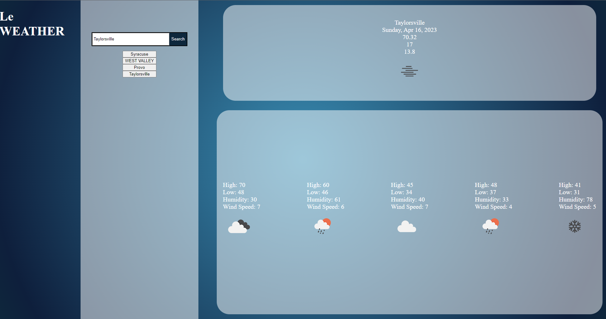

# Le Weather

Le Weather is a weather forecast application. With the simple search form that is on the 
main page, search any city that you'd like to get a full six day weather forecast! 
The current weather will be displayed in a card at the top of the page while the five day
weather forecast will appear in a row right below. This forecast will give you the 
current day along with the rest of the week's wind speeds and humidity.  

This app was made using HTML, CSS, JavaScript, and 3rd party API's. [OpenWeatherMap](https://openweathermap.org/api) was used to make the api calls to get all of the forecast information.
***

## Forecast 

***

## License
Please refer to the license in the repository.
***

## Thank you!